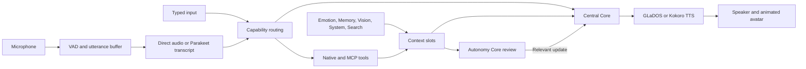

# GLaDOS Personality Core

A voice assistant with GLaDOS’s custom voice, dry humour, camera observations,
persistent memory and tools. Talk through a local microphone or the browser,
watch the animated core respond, and inspect what each mind is doing.

The project began with a simple question: could we build the personality core
from Portal? The current system combines a conversational model with independent
cores for emotion, memory, vision, system health and research. Their observations
feed a shared context, while an Autonomy Core decides when an update deserves a
spoken response.

[Discord](https://discord.com/invite/ERTDKwpjNB) ·
[Sponsor](https://ko-fi.com/dnhkng) ·
[Web console guide](docs/webapp.md) ·
[Architecture](#how-the-cores-work)

https://github.com/user-attachments/assets/c22049e4-7fba-4e84-8667-2c6657a656a0

## What it does

- **Voice conversation:** Gemma 4 E4B can receive audio directly. An extended
  profile uses Parakeet transcription with a different conversation model.
- **GLaDOS speech and animation:** spoken emotion directions move the browser
  avatar; a separate Emotion Core maintains pleasure, arousal and dominance.
- **A functional web console:** control microphone, voice and camera; inspect
  minds, context slots, routing decisions, saved memory and background tasks.
- **Vision:** E4B describes the current scene and recent changes using timestamped
  images. Observation timing adapts to motion; the default range is 2–5 seconds.
- **Memory and research:** retain conversation summaries and useful facts,
  retrieve relevant memories, and perform requested internet research.
- **Tools:** connect MCP services, including Home Assistant, and use native
  controls for preferences, memory, tasks and allowlisted system commands.
- **Proactive responses:** independent cores publish evidence for the Autonomy
  Core to review. User interactions take priority over new background inference.

## Quick start

You need Git and Python 3.12 or newer to run the installer. It creates a Python
3.12.8 environment, installs GLaDOS and downloads the local ONNX speech models.
The conversation model runs in a **separate server**.

The reference setup uses a CUDA build of llama.cpp and Gemma 4 E4B. See the
[model setup and measured results](docs/gemma4.md) for hardware and context
capacity details; latency and memory use depend on your machine and enabled cores.

### 1. Install GLaDOS

```bash
git clone https://github.com/dnhkng/GLaDOS.git
cd GLaDOS
python scripts/install.py
```

The installer selects CUDA when its utility is available, an installed ROCm
backend otherwise, or CPU. You can override this:

```bash
python scripts/install.py --backend cpu
python scripts/install.py --backend cuda
python scripts/install.py --backend amd --rocm-version 7.2.1
```

Choose the command for your machine; these are alternatives. GPU drivers and
CUDA/ROCm must be installed separately. For AMD, follow the
[AMD setup guide](docs/amd.md): the installer supports Linux x86_64 with ROCm
7.1, 7.2 and 7.2.1, using matching MIGraphX wheels. AMD model performance still
needs hardware validation. An installed OpenVINO provider is also retained by
local audio provider selection; the installer does not supply an Intel runtime.

On Debian/Ubuntu, local microphone and speaker access may require:

```bash
sudo apt install libportaudio2
```

Windows users should install Python 3.12+ and, if a runtime DLL is missing, the
[Visual C++ Redistributable](https://learn.microsoft.com/en-us/cpp/windows/latest-supported-vc-redist).
The AMD installer path is Linux-only. macOS support remains experimental.

### 2. Start the conversation model

Install a Gemma 4-capable CUDA `llama-server` separately. Download these two files
from [ggml-org/gemma-4-E4B-it-GGUF](https://huggingface.co/ggml-org/gemma-4-E4B-it-GGUF)
into `models/gemma4-benchmark/`:

- `gemma-4-E4B-it-Q4_0.gguf`
- `mmproj-gemma-4-E4B-it-Q8_0.gguf`

These GGUF files are **not** downloaded by `glados download`.
Checksums and the tested revision are in the [E4B setup guide](docs/gemma4.md#reproduce-with-llamacpp).
Then, from the repository root, run:

```bash
bash scripts/run_llamacpp.sh
```

If the executable or models are elsewhere:

```bash
LLAMA_SERVER=/path/to/llama-server \
GLADOS_MODEL_DIR=/path/to/gemma-models \
bash scripts/run_llamacpp.sh
```

The launcher serves `gemma-4-E4B` at `http://127.0.0.1:18080`, with four inference
slots and 16K context per slot. It is tuned for CUDA; AMD ONNX installation does
not configure this separate server. Use an appropriate server build/configuration
for other hardware, or choose the extended profile below.

### 3. Open the web console

In another terminal:

```bash
uv run --no-sync glados webapp --config configs/glados_webapp_config.yaml
```

Open **http://127.0.0.1:8050/**. This profile uses the **host machine’s microphone
and speakers** by default. Browser microphone/speaker setup is described below.

Use `--no-sync` after installer-based setup to preserve its selected ONNX runtime,
particularly AMD’s separately installed vendor wheel. Rerun the installer to
update or switch the backend; it preserves the environment and replaces the old
ONNX distribution before installing the selected one.

## Choose a conversation profile

| Profile | Voice input | Conversation backend | Starting configuration |
| --- | --- | --- | --- |
| Default | Audio sent directly to Gemma 4 E4B | llama.cpp, thinking disabled | [glados_config.yaml](configs/glados_config.yaml) |
| Web console | Same direct-audio profile, with browser controls | llama.cpp, thinking disabled | [glados_webapp_config.yaml](configs/glados_webapp_config.yaml) |
| Extended | Parakeet TDT transcription, then text | Ollama or an OpenAI-compatible API | [glados_extended_config.yaml](configs/glados_extended_config.yaml) |

English is the default input language. Direct-audio mode does **not** load
Parakeet. Optional written user transcripts are off by default and use Gemma,
not a second ASR model. Enable them in Facility Settings → Voice input when you
want a written record. Extended mode uses Parakeet transcripts as model input.

The extended profile ships with `gemma4:e4b` on an Ollama endpoint. Supply that
model yourself or change `llm_model`, `completion_url` and the provider-specific
request options. Use a non-thinking model, or its minimal/disabled reasoning
setting, for responsive conversation.

```bash
uv run --no-sync glados webapp --config configs/glados_extended_config.yaml
```

For cloud/text backends, keep `native_audio.enabled: false`; do not send Gemma’s
native audio request format to an API that does not support it. Vision has its
own E4B endpoint and can remain independent of the conversation model.

## Browser audio and camera

The console can use local devices or browser media. To use browser audio, create
`configs/browser_audio.yaml`:

```yaml
Glados:
  audio_io: websocket
  audio_io_options:
    server: 127.0.0.1
    port: 5051
    rooms: false
```

Layer it over the web console profile:

```bash
uv run --no-sync glados webapp \
  --config configs/glados_webapp_config.yaml \
  --config configs/browser_audio.yaml
```

Open the console and use its microphone/speaker controls, granting browser
permission when prompted. The HTTP console uses port 8050; browser audio uses
the separate WebSocket server on port 5051. Camera observations can be controlled
from the console, with camera selection in Facility Settings.

Keep the default loopback binding for local use. Remote browser media needs a
secure browser context and suitable HTTP/WebSocket proxy configuration. A wildcard
HTTP bind also requires explicit `webapp.allowed_hosts`; this allowlist is not
authentication. See the [web console guide](docs/webapp.md) for remote access,
device permissions and configuration.

## Using the console

- **Central Core / Brainstem:** control input, spoken output, camera observations
  and Quiet mode. Quiet pauses replies and background cores until a wake request
  or the Wake control; disabling autonomy only disables proactive responses.
- **Minds:** inspect and control the workers that produce observations and results.
- **Slots:** inspect the current context contributed by those workers. A slot is
  stored information, not another model process.
- **Test Chamber:** inspect the actual request context and its sources, plus saved
  facts and summaries. The live system clock is included in reply context.
- **Facility Settings:** edit response instructions, routing choices and thresholds,
  preferred search sources, vision timing and optional transcripts.

Settings edited in the console persist as YAML under `data/`, including
`operator_settings.yaml`, `decision_lists.yaml`, `search_settings.yaml` and
`vision_settings.yaml`. Console edits apply to the running app; manual file edits
take effect after restart. Memories and summaries have their own persistent
stores. See [memory and console controls](docs/webapp.md) for details.

## Other launch modes

Run commands from the repository root:

```bash
uv run --no-sync glados                         # Local voice mode
uv run --no-sync glados tui                     # Terminal interface
uv run --no-sync glados start --input-mode text # Typed input
uv run --no-sync glados start --input-mode both # Voice and typed input
uv run --no-sync glados say "The cake is a lie" # Speech synthesis only
uv run --no-sync glados download               # Download/check local ONNX models
```

The TUI is an alternative to the web console. Use `Ctrl+P` for its command palette
and `F1` for help. `glados --help` and each command’s `--help` list available
configuration and input/output overrides.

The model downloader currently verifies all registered local ONNX models,
including optional ASR and Kokoro models. Downloading them does not mean they are
all loaded: direct-audio mode skips Parakeet at runtime.

## Configuration

Configuration files contain a top-level `Glados:` mapping. Repeat `--config` to
layer files; values in later files override earlier values. Start with a complete
shipped profile and add small overlays for your changes.

For example, `configs/personal.yaml`:

```yaml
Glados:
  voice: glados # Or a supported Kokoro voice such as af_bella.
  personality_preprompt:
    - system: "You are GLaDOS. Give useful, accurate answers with dry humour."
    - user: "What do you think of my code?"
    - assistant: "It runs. We should preserve this moment for the historians."
```

```bash
uv run --no-sync glados webapp \
  --config configs/glados_webapp_config.yaml \
  --config configs/personal.yaml
```

For a different text conversation backend, layer an override on the **extended**
profile and set `llm_model`, `completion_url`, optional `api_key`/`llm_headers`,
and the model’s supported `llm_request_options`. The included
[MiniMax configuration](configs/minimax_config.yaml) is another provider example;
check your provider’s current model names and request options before using it.

## How the cores work



Independent cores publish regular updates, important updates and task results.
The Autonomy Core considers their evidence together with the conversation before
asking Central to speak. A completed search or recalled fact can be useful
without needing another spoken response if the conversation already covers it.

Background minds share a timer and worker pool, with fixed, adaptive, random
adaptive or on-demand timing assigned separately from their work. They can use
ordinary code or services without an LLM. See [mind scheduling](docs/autonomy.md#mind-execution-and-timing).

Inference is admitted through a shared, bounded scheduler. The reference profile
uses four server slots, with two reserved for interaction and routing. New
background work waits during user interactions; already-running inference may
finish, and stale outputs are rejected. Routing stays available. This reduces
competition for the GPU without creating a separate model for each mind.

With llama.cpp, capability routing scores a small fixed set of token options.
It can choose a reply, an intentional silence or an available action. Text
replies may be drafted in parallel when capacity is free; direct-audio drafts
remain disabled. Model-server capabilities determine which optimizations apply.

Speech capture uses 32 ms VAD chunks and a 416 ms silence gap. If the user resumes
before the pending response begins delivery, the new speech can extend that turn
and invalidate the pending response. Interruption also stops playback when
`interruptible` is enabled. These timings do not imply a fixed end-to-end latency;
[benchmarks and caching details](docs/gemma4.md) describe the measured setup.

Emotion markers such as `[emotion:neutral]` direct the avatar while speech is
chunked for synthesis. They do not set the Emotion Core’s PAD state. Vision uses
E4B scene observations and timestamped recent frames; YuNet face tracking uses
OpenCV separately. The old FastVLM backend is no longer part of the app.

More detail: [autonomy](docs/autonomy.md), [vision](docs/vision.md),
[web console and routing](docs/webapp.md), [inference investigation](docs/native-inference.md).

## Tools and integrations

Native tools include memory management, user preferences, task cancellation,
slot management, reports, camera look requests and a fixed set of safe system
commands. They are not a general-purpose shell interface.

MCP adds external capabilities through stdio, HTTP or SSE. For example, an
overlay can register the bundled system-information server:

```yaml
Glados:
  mcp_servers:
    - name: system_info
      transport: stdio
      command: python
      args: ["-m", "glados.mcp.system_info_server"]
```

An `mcp_servers` override replaces that list, so include any other servers you
want to retain. The shipped profiles include requested internet search through
Exa; this contacts an external service when research is used. Home Assistant
requires your own server and credentials. See [MCP configuration](docs/mcp.md)
for tool filtering, memory services and transport setup.

## GLaDOS speech API

The optional API exposes the **GLaDOS voice** through an OpenAI-style
`POST /v1/audio/speech` endpoint. Other API voices and speed adjustment are not
implemented. This endpoint does not require the conversation model server.

```bash
python scripts/install.py --api
uv run --no-sync litestar --app glados.api.app:create_app run \
  --host 127.0.0.1 --port 5050
```

For AMD, retain the same `--backend amd --rocm-version ...` options when running
the installer with `--api`.

```bash
curl -X POST http://127.0.0.1:5050/v1/audio/speech \
  -H "Content-Type: application/json" \
  -d '{"input":"Hello, test subject.","voice":"glados","response_format":"mp3"}' \
  --output speech.mp3
```

The API supports MP3, WAV and OGG output. It reuses the synthesizer by default;
set `Api.reuse_tts: false` in [api_config.yaml](configs/api_config.yaml) or use
`GLADOS_API_REUSE_TTS=false` to load it per request.

A Docker API setup is also supplied:

```bash
docker compose up -d --build
```

This serves port 5050. It is the speech API, not the browser console or an
installer for the E4B model server.

## Troubleshooting

| Symptom | Check |
| --- | --- |
| No reply / cannot reach model | Start the separate model server; check its URL, model alias and profile. Default E4B expects port 18080. |
| Missing model files | Run `uv run --no-sync glados download`; obtain the E4B GGUF and projector separately. |
| AMD provider missing or CPU fallback | Check the matching ROCm release, driver and wheel; use the AMD guide and startup session-provider logs. |
| Runtime changed after launching | Use `uv run --no-sync` after installer setup; do not mix CPU, CUDA and AMD ONNX distributions. |
| Browser microphone unavailable | Select the WebSocket audio backend, start port 5051, grant permission and use localhost or a secure origin. |
| Rejected remote console host | Configure explicit `webapp.allowed_hosts` alongside the bind address; see the web console guide. |
| GLaDOS hears her own voice | Use headphones or echo cancellation; disable `interruptible` if playback is retriggering input. |
| She stays quiet | Check microphone/voice controls, Quiet state and whether the router chose not to respond. |

## Development and next steps

For a separate CPU development environment:

```bash
uv sync --extra cpu --extra dev
uv run --no-sync pytest -q tests
```

The API tests require the `api` extra and downloaded speech models. Do not use
this CPU sync command to update an AMD environment; it replaces the selected
runtime. Installer-based environments can add development tools with
`uv pip install -e ".[dev]"` instead.

Recorded tests and experiments are in [docs/benchmarks](docs/benchmarks), with
runnable probes in [examples](examples). The
[refactor roadmap](plans/architecture-refactor-progress.md) records remaining
runtime work; [roadmap.md](docs/roadmap.md) covers broader directions. AMD model
validation, streaming ASR and physical animatronics remain future work.

## Community

Questions, experiments and feedback are welcome on
[Discord](https://discord.com/invite/ERTDKwpjNB). You can also
[sponsor development](https://ko-fi.com/dnhkng).

GLaDOS and Portal belong to Valve. This is a fan project.

[](https://www.star-history.com/#dnhkng/GLaDOS&Date)
