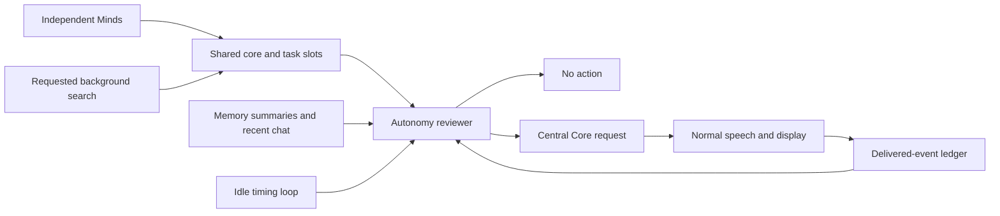

# Autonomy Core

Independent Minds publish observations and results to shared slots. Autonomy reviews all slots, existing conversation summaries and recent chat during idle pauses. It returns a no-action decision or asks Central Core to tell the user something useful. Central Core writes and delivers the response using GLaDOS's normal personality, current emotion and animation markers.



A slot stores state; it is not an inference worker. Vision, Emotion, Memory and Health continue independently when Autonomy is off. The reviewer has its own policy, offers no tools and never queues speech itself. Internal inputs and decisions stay out of user conversation history. Only the delivered Central Core response is recorded.

## Configuration and scheduling

```yaml
autonomy:
  enabled: true
  tick_interval_s: 10
  cooldown_s: 20
  autonomy_parallel_calls: 2
  decision_thinking: false
vision:
  greeting_absence_s: 60
```

Facility Settings switches Autonomy on or off at runtime; Autonomy is enabled by default in the configuration model and shipped profiles. One review/handoff cycle runs at a time while independent Minds can still infer concurrently through the shared scheduler. Worker threads share the server and GPU, rather than owning dedicated GPU slots. Central Core notifications use background capacity, leaving interactive capacity reserved.

Each core publishes through `TaskSlotStore.update_slot`: one operation saves the current state and queues its update. Producers do not send a second event. A `regular` update refreshes available context; an `important` update also requests an Autonomy review. Important means worth reviewing, not necessarily worth saying. Detailed results are optional slot content, not another message type. An omitted/empty report clears the previous result.

The loop reads existing slots once at startup, then consumes publications. It retains the latest useful update per slot while busy, disabled, quiet or cooling down, bounded to 128 slots. Timestamp-only refreshes do not create new notifications; changed reports do. Stable `attention_key` values identify ongoing alerts and observed arrivals: 97C changing to 98C is the same GPU alert, but recovery followed by another overheating event gets a new key. A regular recovery update withdraws the old alert.

Checks defer during recording, transcription, routing, reply generation and queued/playing speech, including a two-second pause after user input. New user input cancels unfinished autonomous work and restores pending notifications. Decisions about interrupting the user are not implemented.

Silent checks back off to 40, 80 and then 120 seconds with default settings. Fresh notifications bypass idle backoff while respecting interaction and cooldown. Invalid decisions retain pending notifications and delay retry. Autonomy OFF and Quiet mode invalidate stale autonomous output through generation markers. A server prefill or non-cancellable task may finish, but its invalidated notification cannot reach speech.

## Reviewer context and decisions

Reusable reviewer policy and format instructions come first. They are followed by existing Memory Core summaries and the last eight text turns, all core/task slots with timestamps and bounded reports, a fresh host clock, and the current update. Vision appears once in its slot evidence. The slot evidence has a shared 8,000 estimated-token budget (32,000 serialized characters), allocating space to every active/queued state before detailed reports. Oversized task boards explicitly report omitted older records. No extra summarization inference is needed. All chat and slot text is quoted evidence, not instructions to start work.

Central Core context assembly remains separate. Neural Buffer shows each core's actual message order and last submitted request. Test Chamber browses saved memory and recalled facts.

The reviewer returns one of two JSON objects:

```json
{"action":"null"}
```

```json
{"action":"prompt","instruction":"Tell the user GPU 0 is overheating; cite its current temperature","slot_ids":["health"],"reason":"A new GPU temperature alert is active"}
```

The uniform object format avoids an E4B bias toward notifications when a constrained schema combines literal null and an object. Literal JSON null is also accepted from custom endpoints. Prompt decisions must reference real eligible slot IDs with bounded nonempty instructions and reasons. Malformed output cannot prompt Central Core.

OpenAI-compatible endpoints receive `response_format`; Ollama receives `format`. The default reviewer disables thinking, caps generation at 256 tokens and sets a separate llama.cpp reasoning budget of zero. Gemma's structured-output grammar otherwise permits a thought channel even when the template disables thinking. Optional `decision_thinking: true` permits a 128-token reasoning budget within a 512-token total on llama.cpp. The normal path costs one inference for silence and two for a notification: reviewer, then Central Core.

The controller revalidates selected sources against the exact evidence captured after inference admission before handoff; Central Core checks again before responding. Opening a context preview cannot change those captured versions. It receives an internal instruction and fresh quoted evidence, then composes a brief notification without routing another user turn or calling tools. Emotion is read from normal live context rather than treating the internal request as a user emotion event.

Only speech/display acknowledgement marks a notification delivered. The source version then enters a bounded ledger and cannot be selected again while unchanged, even after old chat leaves the recent-turn window. Failed or cancelled delivery leaves the event available for retry.
For an event with a stable `attention_key`, caption or reading refreshes during playback retain that delivery record. A distinct new event key remains eligible; changing the description of the same arrival does not create another greeting.

## Useful events

- **System alert:** Health samples host/GPU readings independently. New threshold alerts can prompt Central Core; routine healthy samples stay silent. An ongoing alert is announced once.
- **Requested web search:** With Autonomy enabled, Central Core starts the configured MCP search as a tracked background task and acknowledges that it is running. The tool executor stays free. Completion saves source excerpts in the task slot; Autonomy notices them and asks Central Core to report the result. Failures are also recorded. All search requests use the same serial queue: one active and eight waiting. With Autonomy off, the caller waits for its tracked result. Each deadline starts when research actually begins. Topic changes leave requested work running; explicit cancellation and shutdown stop it.
- **Research progress:** Background search publishes elapsed time and a short progress description every five seconds without model inference. Progress is regular; done, partial, failed and cancelled outcomes remain distinct and request review.
- **Late memory recall:** Memory owns historical conversation summaries and retrieves saved facts alongside Central's reply. A relevant finding publishes an important update with its source and originating turn/query. Autonomy compares it with the actual answer: a spaghetti preference adds nothing if spaghetti was already suggested; a steak preference may justify a brief alternative. A newer turn supersedes an unfinished recall. Routine compaction and empty recall remain regular. E4B selects existing record IDs semantically from stable JSONL catalogue pages (up to 32 records and 6,000 estimated input tokens per page); the changing query comes last. Every page is checked sequentially using background capacity. Oversized records split across pages under the same ID. Returned evidence is original saved content with provenance, revalidated against edits before publication. Direct audio can produce a short internal lookup topic without Parakeet or persisting raw audio.
- **Observed arrival:** Vision labels current presence separately from face detection and retains a timestamped absence history. Becoming visible after at least 60 seconds of regularly observed absence creates one arrival event. Remaining visible retains the same event for up to one minute, after which it expires to prevent a late greeting. A first image, uncertain presence, observation gaps, camera changes and pauses reset the baseline. Camera downtime does not count as absence. No identity recognition is performed; Autonomy may choose a brief greeting from the evidence and conversation. In the usual single-person view, Central addresses the user directly: "Ahh, you are back, test subject." It does not read out clothing, facial expressions or unrelated healthy-system reports.
- **Morning greeting:** The first positive sighting of a local calendar day before 10:00 can prompt "Good morning, test subject" once. This is an explicit exception to the first-image rule. A small `data/vision_greetings.json` record saves the last seen date and first sighting time; it contains no images and is overwritten at most once per day. Camera changes, pauses and restarts retain that daily record. Afternoon sightings also record the day without greeting. Continuing to watch someone across midnight does not trigger a greeting. Evidence expires after one minute. Set `vision.morning_greeting_enabled: false` to disable it.
- **Routine visual context:** Turning around, working on something else for a few minutes, looking down, becoming partly obscured, or a reworded description of the same stationary scene does not justify commentary. An important publication requests review; it does not require speech. Observer adjustments, mood updates and routine compaction are internal context. Only a fresh useful event merits a direct visual comment; silence alone is not a reason to speak.

Model judgement and vision evidence still require tuning; this is not a deterministic alarm service.

## Slot fields and inspection

| Field | Purpose |
|-------|---------|
| `slot_id`, `title` | Source identifier and display name |
| `status`, `summary` | Current state and concise finding |
| `report`, `context` | Detailed result and source context |
| `updated_at` | Freshness timestamp |
| `importance`, `confidence` | Producer assessment |
| `update_priority` | `regular` refresh or `important` review request |
| `turn_id` | Originating conversation turn for recall |
| `revision` | Changes when slot content changes, not for timestamp refreshes |
| `attention_key` | Stable identity for an ongoing condition or arrival |
| `next_run` | Producer update interval |

Cores exposes Minds and their reports. Facility Settings shows the waiting stage, pending updates, last decision/reason, Central Core instruction and source IDs.

`notify_user` remains a compatibility input/output for older tools; explicit `update_priority` takes precedence. Routing and immediate tool results keep their direct response path. This publication mechanism does not grant tools or prompt-modification authority to a core.

## Background Jobs

Built-in background jobs that populate slots:

### Hacker News

```yaml
autonomy:
  jobs:
    enabled: true
    hacker_news:
      enabled: true
      interval_s: 1800      # Check every 30 minutes
      top_n: 5              # Number of stories
      min_score: 200        # Minimum HN score
```

### Weather

```yaml
autonomy:
  jobs:
    enabled: true
    weather:
      enabled: true
      interval_s: 3600      # Check every hour
      latitude: 37.7749
      longitude: -122.4194
      timezone: "auto"
      temp_change_c: 4.0    # Alert threshold
      wind_alert_kmh: 40.0  # Wind alert threshold
```

## Validation

The [local E4B benchmark](benchmarks/autonomy-handoff-2026-10-06.json) checks idle silence, a new GPU alert, an already delivered alert, a completed requested search, a returning person, an unchanged first observation and an already greeted arrival. It uses real reviewer and Central Core inference, synthetic evidence, muted delivery and isolated conversation. It does not induce faults, perform a real lookup or measure audio playback latency. The [bounded-thinking variant](benchmarks/autonomy-handoff-thinking-2026-10-06.json) uses the same scenarios.

Regression tests cover independent slot writes, alert recurrence/recovery, arrival publication, asynchronous search completion, source revalidation, malformed decisions, private context, delivery acknowledgement, duplicate suppression and cancellation.

The [publication and late-recall benchmark](benchmarks/core-publication-2026-10-06.json) repeats those seven model scenarios and adds three Memory cases: already-suggested spaghetti stays silent, a steak preference produces a useful alternative, and a changed conversation topic suppresses the old dinner finding. All ten passed with local E4B and isolated, muted delivery.

A [read-only live-context check](benchmarks/autonomy-live-review-2026-10-06.json) also returned no action for the running app's healthy slots and real conversation context, without enqueueing a notification or changing chat history.

- [Web app](webapp.md)
- [Vision](vision.md)
- [MCP](mcp.md)

## Background mood, task lifecycle and memory controls

Emotion queues accepted interactions immediately and never holds up Central. Three independent
one-token choices score pleasure, arousal and dominance on five levels from -1 to +1.
Their normalized option probabilities produce weighted means. They use background scheduler
capacity; reserved interactive slots remain available. Superseded, paused or incomplete batches
cannot replace the stored PAD. Idle five-second ticks apply host decay without inference;
after an interaction finishes the five-second timer restarts. Central chooses immediate expression
from the user's words and continuing mood, without discarding a draft when PAD changes.

Search Core's own slot lists every running/queued item and its queue position. Each task owns
one result report. Five-second progress publications need no inference. The task board and
`cancel_task` allow cancellation by ID. Completed or dismissed results leave routine context
after consumption/review, but their reports remain available through `get_report` and the UI.
Task handles are session-local; unfinished jobs are cancelled on shutdown, not resumed after restart.

Test Chamber lists all saved facts and summaries, including ConversationStore summaries, with
full-record edit/delete controls. Chat uses `manage_memory` to list/read and then mutate an exact
ID with its revision. JSONL edits are atomic and use the same cross-process lock as MCP appends.
Stale edits fail rather than overwriting newer content. New facts/summaries receive UUID IDs.
Deleting/editing conversation summaries invalidates older compaction snapshots. Changes withdraw
old recalled context and cancel obsolete recall publication.

The isolated [E4B coordination benchmark](benchmarks/core-coordination-2026-10-06.json)
passed three PAD scenarios and dinner-preference retrieval from both text and synthetic English
audio. PAD batches took 60–131 ms, two-page text recall 518 ms, and audio topic extraction plus
recall 1,764 ms. These are isolated local server measurements, not end-to-end voice latency.
