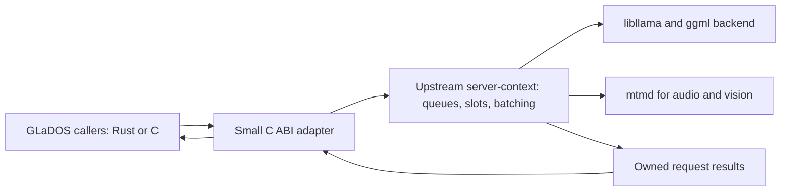

# Native llama.cpp inference for GLaDOS

Assessment date: 2026-10-06. Model: Gemma-4 E4B IT, Q4_0 GGUF.

The [Rust migration plan](rust-migration.md) places this work in the delivery
sequence: bring the current GLaDOS close to feature complete, then port the
application to Rust using its established behavior as the reference. This
assessment supplies evidence for the future native inference component.

## Recommendation

Embed upstream llama.cpp's `server-context` library behind a small C ABI adapter. This provides asynchronous requests, continuous batching and native results without an HTTP endpoint. The scheduler is already a separate upstream build target, so extracting its source or maintaining a full server fork is unnecessary.

For routing alongside ongoing text generation, initially use a one-token completion and its candidate probabilities. Upstream also supports genuinely zero-token decision requests, but the tested revision cannot batch them with active completion requests. This distinction matters for interactive latency.

This is a feasibility result. The embedding prototype works; a production adapter, Rust integration and replacement of GLaDOS's HTTP client remain to be implemented.

## Upstream version and build status

The checkout at `/home/dnhkng/Documents/LLM/llama.cpp` was fetched and fast-forwarded from `687e7789271ec1276e3470f158428e11a4f80b6f` to **`6c73b3e12dc501de35fe5f6979960d06921a2f6c`**, matching `origin/master` when checked on 2026-10-06. Tracked upstream source remained unmodified.

A separate CPU proof build was created in `build-glados-native`, reporting `b1112-6c73b3e12`. It successfully linked the native server core and ran both request modes without an HTTP listener. The live GPU server still uses the existing `b1-687e7789` binary. Updating the source checkout did not upgrade that running service.

The exact revision, build configuration, reproduction commands and results are recorded in the [embedding assessment](benchmarks/llamacpp-embedding-assessment-2026-10-06.json).

## What can be reused

Upstream defines a position-independent static `server-context` target separately from the HTTP/UI implementation. It contains model ownership, request queues, slots, prompt processing, generation and continuous batching. Our proof links that target with its shared dependencies, including `llama-common`, `libllama`, `ggml` and `mtmd`. See the pinned [build targets](https://github.com/ggml-org/llama.cpp/blob/6c73b3e12dc501de35fe5f6979960d06921a2f6c/tools/server/CMakeLists.txt).

The native interface is C++ with internal types and STL objects. It is unsuitable as a stable Rust or C ABI directly. The proposed application boundary is:

The adapter should expose opaque engine/request handles, submission, result polling or streaming, cancellation and destruction. Rust can wrap these in futures and channels. It must copy results into owned buffers, define their lifetime and prevent C++ exceptions from crossing the ABI.

One native owner thread runs `server_context::start_loop()`. Callers submit work through response readers rather than concurrently invoking `llama_decode()` on the same context. The core reads each request's logits at the appropriate decode step; the adapter returns copied scores through the result queue. External threads must not inspect the live context while it is decoding. The pinned [context API](https://github.com/ggml-org/llama.cpp/blob/6c73b3e12dc501de35fe5f6979960d06921a2f6c/tools/server/server-context.h) and [queue API](https://github.com/ggml-org/llama.cpp/blob/6c73b3e12dc501de35fe5f6979960d06921a2f6c/tools/server/server-queue.h) describe this boundary.

Linux embedding was tested. A Windows DLL package and Rust FFI implementation were not tested.

## Parallelism and asynchronous arrival

Multiple requests retain independent sequence/cache state and contribute work to shared model batches. This provides concurrent inference through batching; it does not require an independent GPU decode call from each caller thread. An asynchronous interface keeps callers from blocking, while the native scheduler supplies the batching.

With continuous batching enabled, a fourth request can join at a subsequent decode boundary when a slot, cache capacity and compatible batch are available. It need not wait for the first three to finish. If all slots are occupied, it queues. A running decode call is not interrupted halfway through to insert new work.

GLaDOS's launcher already enables `--parallel 4 --cont-batching`. An embedded implementation must also preserve the application scheduling policy in [inference.py](../src/glados/core/inference.py): router priority, reserved interactive capacity, bounded admission and cancellation. The upstream queue's front-insertion flag alone does not reproduce that policy.

## Routing from prompt logits

At the end of prompt processing, the last prompt position produces logits predicting the next token. For a prompt ending at Gemma's assistant header, these can score answer labels such as `A`, `B` and `C`. There is no need to append an answer letter first.

The current upstream `SERVER_TASK_TYPE_DECISION` accepts candidate token IDs and returns their raw logits. Its result path releases the slot before sampling. Direct native decision tasks worked with the ordinary Gemma-4 E4B GGUF; this does not establish compatibility with the public `/v1/systemone` endpoint, which imposes additional model metadata requirements. See the pinned [task definitions](https://github.com/ggml-org/llama.cpp/blob/6c73b3e12dc501de35fe5f6979960d06921a2f6c/tools/server/server-task.h) and [decision result path](https://github.com/ggml-org/llama.cpp/blob/6c73b3e12dc501de35fe5f6979960d06921a2f6c/tools/server/server-context.cpp#L2330).

A one-token completion selects and emits a token using those same final-prompt logits. Stopping after that first token avoids feeding it back for another transformer pass. Zero-token scoring removes token selection/emission, but does not eliminate an extra transformer pass relative to this one-token case. Native embedding also removes HTTP/JSON transport overhead; its performance benefit has not yet been measured.

Candidate logits need explicit interpretation. A softmax over the candidate labels measures confidence conditional on those labels; it is different from their probability mass across the full vocabulary. Preserve the router's intended score semantics and verify that each label maps to the expected single token.

## The mixed-task limitation

At the pinned revision, `can_batch_with()` requires matching task types, along with compatible embedding inputs and LoRA settings. A decision task therefore cannot join a completion batch. A free slot is insufficient to guarantee immediate computation. See the [batch compatibility check](https://github.com/ggml-org/llama.cpp/blob/6c73b3e12dc501de35fe5f6979960d06921a2f6c/tools/server/server-context.cpp#L473).

The [embedding probe](../examples/probe_embedded_server.cpp) started three completion requests and waited until each had emitted one real token. All three were still running when the fourth request arrived:

| Fourth request | Route tokens emitted | Earlier requests at route result | Selected label |
| --- | ---: | --- | --- |
| Native decision task | 0 | All three had finished | B |
| One-token completion | 1 | All three were still running | B |

Both runs used the latest unmodified core, four slots and CPU inference. Each earlier completion generated 48 tokens. This verifies late-arrival behavior for the tested modes, rather than GPU throughput or a latency speedup.

Use completion-based scoring for an initial shared generation/routing engine. Ensure the probability result includes every required candidate; the probe's top-eight output is not a general guarantee. Use decision tasks for workloads containing only scoring requests. Mixing strict zero-token decisions with active generation needs an upstream compatibility change, a downstream patch or a separate scheduling/model arrangement.

## Earlier GPU evidence

The earlier probes used revision `687e7789`, rather than the latest CPU embedding build:

| Probe | Result | Scope |
| --- | --- | --- |
| [Parallel logits](benchmarks/gemma4-parallel-logits-2026-10-06.json) | Four independent sequences and four logit rows in a decode call; 376 prompt evaluations, zero generated tokens | Fixed groups, not dynamic admission |
| [Prompt positions](benchmarks/gemma4-prompt-positions-2026-10-06.json) | Final prompt logits classified 59/62 held-out variants correctly (95.2%) | Small, manually labelled text dataset |

Batched and reordered choices matched isolated choices in the parallel probe, but confidence values changed with batch shape. An acceptance gate changed on 3/124 variants. Production thresholds therefore need validation with the intended batching configuration.

Stopping at earlier prompt positions did not improve accuracy. The tested early-exit policy achieved 58/62 held-out decisions versus 59/62 using the final position. The evidence supports scoring after the full assistant header rather than truncating it.

## Maintenance and next steps

Keeping a small adapter and pinning upstream is preferable to copying the scheduler. Rebuild the adapter with each selected upstream revision and run compatibility checks before upgrading: the internal C++ API can change even when our public C ABI remains stable.

A custom batcher is feasible for narrowly scoped text-only prompt scoring. GLaDOS also needs streaming, multimodal processing, prefix reuse, sliding-window cache handling and cancellation. Owning those behaviors would substantially increase the maintenance burden. A small mixed-task compatibility patch may be possible, but it still needs validation across cache handling, GPU execution and other task modes; no such patch was made in this investigation.

The next implementation steps are:

1. Build the C ABI adapter and expose asynchronous request/results to the application.
2. Preserve GLaDOS's priority and capacity reservations, with bounded queues and reliable cancellation.
3. Validate all candidate probabilities against the existing HTTP router, including threshold behavior under changing batch shapes.
4. Measure CUDA late-arrival latency and throughput with real mixed workloads; then exercise streaming, audio/vision, cache reuse and shutdown.
5. Revisit strict zero-token mixed batching after checking or proposing upstream support.

Replacing endpoint calls can proceed independently of a full GLaDOS rewrite. The current evidence establishes that the native engine is reusable and that its completion path dynamically admits work; it does not yet establish a production performance gain or complete native feature parity.
